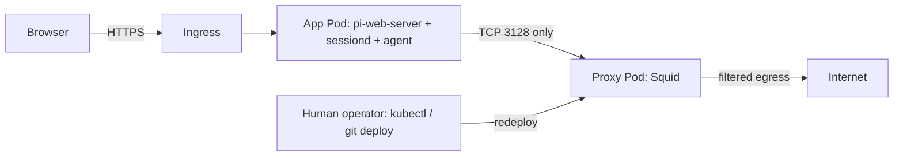

# Sandbox Separation Implementation Plan

> **Amendment (2026-10-05): Squid removed in favor of pi-sandbox.**
> The core boundary described below (separate proxy container, internal-only
> networks, operator-only mode switching) was implemented in `aeda0bb` and then
> deliberately replaced: Squid, the proxy container, the MITM CA, and the
> network-mode machinery are gone. Outbound and Bash-filesystem policy are now
> enforced per-command inside the agent container by `@erichll/pi-sandbox`
> (bubblewrap + seccomp, `strictAllowlist` mode, subagents off), and
> Pi-native-tool/path policy by `@gotgenes/pi-permission-system` with
> human-only prompts (no authorizerChain). Stack moved to pi 1.0.4. The
> Kubernetes plan still applies for the Pod boundary (seccomp/userns posture
> for bwrap, read-only policy mounts); the Proxy Pod does not need to be
> built. The rest of this document is kept as the historical record of why
> the single-container design was inadequate and what was built first.

## Goal

Harden the personal agent workspace against accidental actions and provide basic
containment for a compromised or malicious agent.

The production target is Kubernetes. Docker Compose should reproduce the same trust
boundaries closely enough for development and integration testing.

Two original problems define the scope:

1. The agent could switch itself between `allowlist` and `open-get` network modes
   without a human decision.
2. The root filesystem is writable and the container still needs a root entrypoint,
   sudo, and an immutable-sudoers dance.

A review of the current implementation showed that both problems come from the same
root cause: **policy enforcement lives inside the agent's own trust boundary.** The
same review showed that outbound filtering is currently advisory rather than enforced
(see "Current state"), so fixing it requires a network boundary the agent cannot
modify. That is the reason for the split, not a desire for a microservice
architecture.

## Scope decision

The enforced boundary is mandatory. The process-level fan-out is not.

| Decision | Status | Reason |
|---|---|---|
| Remove agent-invokable mode switching | Core | Original goal; the agent must not hold its own policy switch |
| Separate Squid into its own Pod/service | Core | Enforcement has to live outside the agent network namespace |
| Enforce proxy-only egress with NetworkPolicy / internal networks | Core | Only way ordinary TCP egress can be constrained |
| Non-root, read-only rootfs, dropped capabilities, no sudo | Core | Original goal; simpler once proxy management is gone |
| Move mode switching to an operator action (deploy/CLI) | Core | Satisfies the usability need without a new control-plane service |
| Split `pi-web-server` from `pi-web-sessiond` across Pods | Deferred | Real benefit (human auth plane vs agent exec plane), but not needed for network containment |
| Dedicated network-controller API | Deferred | Only justified once switching must be in-browser |
| Browser-facing network-mode plugin | Deferred | Depends on the controller API |
| Separate Web and controller images | Deferred | Packaging choice, not a security requirement |

### Core topology

One App Pod keeps Pi Web and sessiond together as they are today. One Proxy Pod owns
Squid, the policy templates, the allowlist, and the MITM CA private key. Nothing in
the App Pod can change proxy policy. The human changes mode by redeploying the
Proxy Pod.

### Deferred topology

The previously considered four-component design (Web Pod, Agent Pod, Proxy Pod,
network controller, plus a browser plugin) remains the direction of travel if
in-browser mode switching becomes a real usability requirement. It is documented in
"Deferred phases" and should not be built before the core boundary is working and
validated.

## Threat model and boundaries

The design should:

- Keep `/workspace` as the agent's intentional writable blast radius.
- Prevent the agent from bypassing outbound filtering with direct sockets.
- Prevent direct DNS use and DNS exfiltration by the agent.
- Keep network policy and proxy configuration outside the agent trust boundary.
- Make the network mode visible to the human and changeable only by the human.
- Run the agent without root privileges after trusted startup responsibilities have
  been removed.
- Preserve Pi Web sessions, scheduled state, and the dedicated NFS workspace.
- Keep Kubernetes as the authoritative deployment definition while retaining a
  representative Compose test environment.

This design does not attempt to protect files intentionally made writable under
`/workspace` from the agent. The dedicated NFS directory and Gitea-backed
repositories provide the recovery boundary.

Credential isolation is intentionally deferred. Note that `k8s-manifests.yml`
currently mounts Gitea and Wiki.js secrets directly into the agent Pod; that is
accepted for now and is the first target of the deferred credential work.

### Raw sockets versus ordinary TCP

Two different things are often conflated:

- **Raw/packet sockets** require `CAP_NET_RAW`. `cap_drop: [NET_RAW]` in
  `docker-compose.yml` already prevents these.
- **Ordinary TCP/UDP sockets** need no capabilities at all. Any unprivileged process
  can open one.

Dropping `NET_RAW` therefore never forced traffic through Squid. The agent can open a
TCP socket to any reachable address with `curl --noproxy '*'`, Python, Node, or a
shell redirect.

### Why the current implementation is bypassable

The current single-container design enforces nothing at the network layer:

- `iptables` is installed in the Dockerfile but no egress rules are applied.
- Enforcement relies on `HTTP_PROXY`/`HTTPS_PROXY` conventions and a
  `/etc/resolv.conf` override pointing at the in-container dnsmasq.
- Squid listens inside the agent's own network namespace, so the agent can also
  restart or reconfigure it through sudo.
- No Kubernetes NetworkPolicy exists, so the deployed Pod has unrestricted egress.

Proxy environment variables and DNS overrides are usability defaults. **They are not
security controls.** Only infrastructure-level filtering counts.

## Target architecture (core)

### App Pod

- Runs `pi-web-server` and `pi-web-sessiond` as today, on port 8504.
- Runs scheduled tasks if the scheduler remains in this deployment.
- Mounts the dedicated NFS workspace and persistent Pi state.
- Runs as UID/GID 1001, non-root, no sudo, no network-administration capabilities,
  read-only root filesystem.
- Has no direct Internet or DNS egress. Its only outbound path is TCP 3128 to the
  Proxy Pod plus explicitly approved internal dependencies.
- Contains no Squid, no dnsmasq, no CA private key, no proxy templates.

### Proxy Pod

- Runs Squid as the outbound policy enforcement point, plus the MITM
  `security_file_certgen` machinery for open-GET mode.
- Owns the trusted config templates, the allowlist, and the CA private key.
- Listens for proxy traffic on TCP 3128; ingress restricted to the App Pod.
- Holds the DNS and external egress permissions required to reach approved
  destinations.
- Holds no workspace, no Pi state, no agent credentials.

The Proxy Pod must not be a sidecar in the App Pod. Containers in a Pod share a
network namespace, so a sidecar Squid is still inside the agent boundary and normal
NetworkPolicy granularity would be lost.

## Why dnsmasq is removed

The App Pod will not be allowed to send DNS traffic. Its only outbound application
path is TCP 3128 to Squid. Squid performs destination-domain policy enforcement and
resolves approved destinations from the proxy trust zone. Because the agent can neither
contact a resolver nor open direct external sockets, an agent-facing DNS filter is
unnecessary.

This depends entirely on mandatory network enforcement. Removing dnsmasq before the
egress policy is in place would be a regression, not a simplification.

The agent still needs name resolution for the proxy address itself. Use a fixed
ClusterIP (or a Service name provided through an `/etc/hosts`-style mechanism) rather
than granting general DNS. Do not give the App Pod DNS just to resolve the proxy
Service name.

## Internal dependencies

Inventory before enforcing anything. Today the agent talks to these directly:

- `SEARXNG_URL` (`http://searxng:8080` in Compose, `https://search.example.com` in
  the cluster).
- `LLAMA_SWAP_URL` (`https://ai.example.com`) and local llama.cpp/llama-swap slots.
- Gitea and Wiki.js for git and wiki operations.
- Anthropic/OpenRouter/OpenAI provider endpoints for hosted models.

Decide per dependency: route through Squid, or list it as an explicit internal
egress destination. Note that the sensitive-address rules below deliberately block
private ranges, so proxying to a cluster-internal SearXNG needs a named, narrow
exception rather than a broad private-range allowance. A provider base URL that is
local (self-hosted llama-swap) is a destination the agent must be able to reach
regardless of proxy mode; treat it as an explicit exception, not as part of the
domain allowlist.

## Squid policy

### Allowlist mode

- Accept only HTTPS `CONNECT` requests.
- Permit only destinations in the configured domain allowlist.
- Reject literal destination IP addresses unless explicitly required and constrained.
- Disable caching.
- Minimize identifying forwarding headers.
- Treat every allowlisted destination as a potential exfiltration endpoint.

### Open-GET mode

- Use TLS interception where required to enforce HTTP methods for HTTPS traffic.
- Permit only `GET` and `HEAD`.
- Remove authorization, cookie, proxy-authorization, forwarding, and other sensitive
  headers.
- Strip query strings when configured.
- Document that paths, hostnames, request selection, and timing still provide
  exfiltration channels. Some services also perform state changes through `GET`.

This is a user-selected convenience mode. It is reasonable protection against
accidental actions. It is not strong malicious-agent containment and the plan should
not claim otherwise.

### TLS interception material

With Squid outside the agent trust zone the CA key and certificate split apart:

- The CA private key lives only in the Proxy Pod (Secret or equivalent) and is never
  mounted into the App Pod or printed.
- The CA certificate is distributed to the App Pod read-only (ConfigMap, or a Compose
  bind mount) and installed into the agent trust store.
- Generate the CA once and persist it. Regenerating per startup would break
  interception on every Proxy Pod restart and force App Pod trust-store updates.

### Address safety

For both modes, prevent approved names from becoming routes into sensitive networks:

- Block loopback, link-local, multicast, and unspecified destination ranges.
- Block Kubernetes Pod and Service CIDRs except explicitly required services.
- Block node, management, and private LAN ranges except explicit requirements.
- Block cloud metadata addresses such as `169.254.169.254`.
- Account for DNS rebinding and names that change address after approval.
- Cover IPv6 as well as IPv4.

Enforce sensitive-address denial in both Squid policy and infrastructure
firewall/NetworkPolicy. Squid alone is not sufficient, since Squid resolves names
that may already have changed by the time a connection is made.

## Mode switching

### Core design: operator-driven

Mode becomes deployment configuration rather than a runtime tool:

- Kubernetes: `NETWORK_MODE` on the Proxy Pod; changing it is a `kubectl apply` /
  GitOps change owned by the human.
- Compose: `NETWORK_MODE` in the environment or `.env`; changing it is
  `docker compose up -d proxy`.

Remove in the same change:

- the `network_mode` Pi tool and `/network` command,
- the `network-mode` script and its sudoers entry,
- the agent-side dynamic sudoers generation and `CAP_LINUX_IMMUTABLE`.

### Reload semantics must be explicit

A successful `squid -k reconfigure` does not necessarily revoke already-established
CONNECT tunnels. Define the intended semantics rather than inheriting Squid's:

- On a transition to a **more restrictive** mode, restart Squid so existing
  tunnels die with it. Restarting is simpler and more predictable than a seamless
  reload, and a brief proxy outage is acceptable for personal use.
- On a transition to a **less restrictive** mode, a reload is fine.

### Fail closed, not "roll back to last known good"

These two are not equivalent when the previous mode was `open-get`. If a transition
to allowlist fails partway, restoring the previous configuration leaves the weaker
policy active while the operator believes the stricter one is in force.

Specify instead:

- A failed or unvalidated restrictive change must leave the proxy stopped, or at
  minimum serving the strictest available policy, and must be reported as failed.
- The operator-visible status must state the mode that is actually active, not the
  mode that was requested.

## Kubernetes network policy

Start from default-deny ingress and egress for both Pods. Confirm the deployed CNI
enforces both ingress and egress, for IPv4 and IPv6.

### App Pod

Allow ingress:

- Pi Web HTTP from the ingress controller only.

Allow egress:

- TCP 3128 to the Proxy Pod.
- Responses associated with permitted connections, as handled by the CNI.
- Explicit internal dependencies only where they cannot route through Squid.

Deny:

- UDP/TCP 53 to CoreDNS or any other resolver.
- Direct Internet access.
- Cluster services, Pods, nodes, LAN devices, and the Proxy Pod management port.
- Kubernetes API access.

Disable `automountServiceAccountToken`. The current manifest has no NetworkPolicy at
all, so this is currently fully unrestricted.

### Proxy Pod

Allow ingress:

- TCP 3128 from the App Pod only.

Allow egress:

- DNS to the approved upstream resolver.
- Required external destination ports.
- Explicit internal destinations for approved local services.

### Ingress

Do not expose the proxy port through the public Ingress. The proxy Service must not be
reachable from anything but the App Pod.

## Agent filesystem and process hardening

Once proxy management leaves the agent image, no root entrypoint is needed.

Configure the App Pod with:

- `runAsNonRoot: true`, `runAsUser: 1001`, `runAsGroup: 1001`
- `allowPrivilegeEscalation: false`
- Drop all Linux capabilities
- `readOnlyRootFilesystem: true`
- `seccompProfile.type: RuntimeDefault`
- `automountServiceAccountToken: false`

Remove from the agent image unless a concrete requirement remains:

- Squid and its CA material (the certificate only is returned as a read-only mount)
- dnsmasq
- `iptables` and network-management tooling
- the network-mode script and Pi extension
- `gosu`
- `sudo` and dynamic sudoers generation
- `CAP_LINUX_IMMUTABLE`

Note that Compose currently uses `seccomp:unconfined`. That has to go for the
hardening to be meaningful, and Pi/node-pty behaviour must be retested without it.

### Read-only rootfs is not the same as protected configuration

`readOnlyRootFilesystem` protects image files. It does not protect anything mounted
writable. Settings, extensions, skills, models config, and Pi Web state are all
bind/PVC mounted today and are therefore writable by the agent regardless of the
rootfs flag.

- Mount trusted inputs (`settings.json`, `models.json`, extension and skill trees,
  proxy CA certificate) read-only.
- Keep only genuinely mutable state writable: sessions, scheduler state, Pi Web data,
  caches, `/tmp`.
- Do not present read-only mounts as a defense against an agent editing its own
  session history or workspace.

Provide explicit writable mounts only for required paths:

- `/workspace` from the dedicated NFS blast-radius directory
- Pi session state
- Pi Web state required by sessiond
- Scheduler state
- size-limited `/tmp` using `emptyDir`
- identified application cache directories

Keep `/app`, bundled extensions, skills, settings, and the rest of the image
filesystem read-only.

## Workspace model

Retain the dedicated NFS-backed `/workspace` as the intended writable blast radius.

Operational safeguards:

- Keep authoritative repository copies in Gitea.
- Protect default branches.
- Do not grant repository-administration or deletion privileges to the agent
  credential.
- Use quotas to limit storage exhaustion.
- Consider NFS or storage snapshots for uncommitted and untracked work.
- Review agent-generated changes before merging them into trusted branches.

Per-task ephemeral workspaces may be considered later; they are not required for the
current personal-use threat model.

## Container images

### Agent image

- Node.js, Pi, Pi Web server and sessiond, extensions, skills, agent development
  tools.
- No proxy, DNS, firewall, sudo, or gosu components.
- Non-root default user, no root entrypoint.

### Proxy image

- Squid (the `squid-openssl` build for interception), trusted config templates,
  minimal validation and health-check tooling.
- No agent runtime, no workspace tools.

Pin production images by digest rather than relying on mutable tags such as `:main`.

A separate Web image and controller image are deferred packaging work; the same base
application image can serve server and sessiond.

## Docker Compose test topology

Reproduce the production data path with separate networks:

- `frontend`: host-facing Pi Web.
- `agent-proxy`: `internal: true`, App container to Squid.
- `proxy-egress`: normal egress-capable network attached only to Squid.

Service attachments:

- `work`: `frontend`, `agent-proxy`.
- `proxy`: `agent-proxy`, `proxy-egress`.
- `searxng`: `proxy-egress` and/or `agent-proxy` depending on the routing decision.

The agent-facing network must be `internal: true` and the `work` service must not
join an egress-capable network.

Compose hardening should mirror Kubernetes where supported:

- run as UID/GID 1001
- read-only root filesystem
- drop all capabilities, remove `cap_add: [LINUX_IMMUTABLE]`
- `no-new-privileges:true`
- `tmpfs` for temporary writable paths
- mount only intended persistent state
- remove `seccomp:unconfined`

Compose is an integration test bed, not proof. An internal network plus correct
attachments are easy to get wrong when a service joins more networks than intended,
so the containment tests below must run against Compose and against the cluster, and
passing in Compose must not be reported as validating NetworkPolicy.

## Migration phases

### Phase 1: Inventory and design confirmation

- List every direct network dependency the agent has today (providers, SearXNG,
  llama-swap, Gitea, Wiki.js, node/network storage, package registries).
- Record cluster Pod, Service, node, LAN, and metadata CIDRs.
- Confirm CNI NetworkPolicy capabilities, including IPv6 and egress support.
- Confirm which Pi Web and scheduler features depend on local proxy/DNS state.
- Decide the proxy Service address strategy that avoids agent-side DNS.
- Decide the routing decision for local internal dependencies.

### Phase 2: Standalone proxy service

- Create the standalone Squid image, templates, and allowlist mounting.
- Move allowlist and open-GET config generation out of the agent image.
- Persist the MITM CA key in the proxy trust zone; distribute only the certificate.
- Point the agent at the remote proxy endpoint.
- Verify that proxy failure causes outbound access to fail closed.

### Phase 3: Enforce the boundary

- Add default-deny egress for the App Pod and allow TCP 3128 to the proxy only.
- Remove agent DNS egress.
- Add the explicit internal-dependency exceptions chosen in Phase 1.
- Run the network containment tests; expect the direct-socket and DNS tests to fail
  before this phase and pass after it.

### Phase 4: Remove the agent-side control path

- Delete the network-mode Pi tool, `/network` command, script, and sudoers entry.
- Delete dynamic sudoers generation and `CAP_LINUX_IMMUTABLE`.
- Make mode an operator-only setting and document the switching procedure for
  Kubernetes and Compose.
- Make active mode observable to the human (status endpoint, `kubectl` output, or
  proxy logs) without giving the agent a write path.

### Phase 5: Harden the agent runtime

- UID 1001 as image and Pod default; no root entrypoint.
- Read-only rootfs, RuntimeDefault seccomp, all capabilities dropped, no privilege
  escalation, no service-account token.
- Explicit temporary and persistent writable mounts; read-only trusted config.
- Remove Squid, dnsmasq, iptables, gosu, and sudo from the image.

### Phase 6: Align Docker Compose

- Mirror the two-service topology and isolated networks.
- Remove the combined-container startup path.
- Apply equivalent non-root and filesystem restrictions.

Phase 3 cannot safely precede Phase 2. Everything else can overlap.

## Deferred phases

To be built only when in-browser mode switching is an actual requirement.

1. **Split `pi-web-server` from `pi-web-sessiond`.** sessiond in the App Pod on a
   private TCP port (7800), server in a Web Pod via `PI_WEB_SESSIOND_URL`, private
   ClusterIP Service, NetworkPolicy permitting sessiond ingress only from the Web
   Pod, and no public route to 7800. Validate sessions, terminals, WebSocket
   streaming, file browsing, projects, workspaces, restarts, and single-daemon
   ownership of the data directory.
2. **Network controller service.** Fixed `GET status` / `POST set-mode` endpoints,
   enumerated values only, no arbitrary command/path/URL input, CSRF protection,
   authentication tied to the deployment, size and rate limits, audit logging, no
   secrets in responses, atomic render-validate-install-reload-verify with last
   known-good preserved and fail-closed semantics as specified above. Prefer a
   tightly scoped container beside Squid over a separate Pod.
3. **Browser plugin.** Status panel plus explicit confirmation before open-GET,
   calling only the controller's fixed API through a same-origin Ingress route such
   as `/network-control/`. Note that Pi Web paired server plugins execute inside the
   session daemon and therefore stay inside the agent trust zone; the plugin must be
   browser-only.
4. **Credential isolation.** Brokered, destination-scoped, operation-scoped
   credentials instead of reusable secrets mounted into the App Pod. Remove the
   current Gitea and Wiki.js secret mounts.

Also later: per-session ephemeral App Pods, per-task workspace snapshots or
worktrees, stronger destination pinning and DNS-rebinding defenses, an identity-aware
proxy in front of the controller, and centralized immutable audit logs.

## Validation checklist

Design the tests before implementing. Proxy environment variables and successful
normal requests are not evidence of containment.

### Network containment

- Proxy-aware HTTPS request to an approved domain succeeds in allowlist mode.
- Proxy-aware request to an unapproved domain fails.
- `curl --noproxy '*'` to an external IP from the agent fails.
- A direct TCP connection from the agent to an external hostname fails.
- A raw socket and an outbound listener attempt from the agent fail.
- UDP and TCP DNS requests from the agent fail.
- Connections from the agent to CoreDNS fail.
- Connections from the agent to cluster, node, metadata, and LAN addresses fail
  unless explicitly permitted.
- The agent cannot reach the proxy management interface or Kubernetes API.
- The agent cannot reach the proxy port of any Pod other than its own.
- The same tests pass over IPv6, not only IPv4.
- Squid can resolve and reach permitted destinations.
- Loss of Squid fails closed.
- After a mode change, previously established tunnels no longer carry traffic.

### Filesystem and privilege

- Agent processes run as UID/GID 1001.
- Root filesystem is read-only.
- Only intended volumes and temporary paths are writable; trusted config mounts are
  read-only.
- No service-account token is mounted.
- No unexpected Linux capabilities remain, including `CAP_LINUX_IMMUTABLE`.
- Privilege escalation is disabled and `seccomp:unconfined` is gone.
- `/workspace` remains writable and persistent as intended.
- Pi Web, node-pty terminals, scheduler runs, and Pi extension loading all still
  work under the stricter profile.

### Mode switching

- Only the operator can change mode; no agent tool, Pi command, sudo rule, or
  Kubernetes permission can do it.
- Invalid and malformed requests or values are rejected.
- Failed Squid validation does not replace the active configuration.
- A failed restrictive transition does not leave the weaker mode silently active.
- Active mode is observable and matches what the operator believes is in force.
- Mode changes are recorded.

## What this plan deliberately does not solve

- A malicious agent inside the App Pod can still read everything mounted there,
  including deferred credentials, and can exfiltrate through any allowlisted domain.
- open-GET mode cannot stop exfiltration through hostnames, paths, request timing, or
  the mere fact of which requests were made.
- Allowlist mode treats every permitted domain as a potential exfiltration endpoint.
- `/workspace` corruption is handled by recovery (Gitea, snapshots), not prevention.
- Human-authorized mode changes are only as trustworthy as the human.
