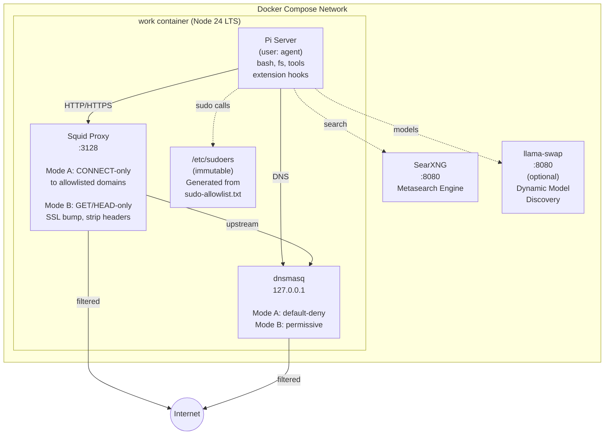

# work

A hardened Docker sandbox for "light" agentic development and research tasks, powered by [pi](https://pi.dev).

---

## Architecture overview



### Security layers

| Layer   | Mechanism                    | Blocks                                                     |
| ------- | ---------------------------- | ---------------------------------------------------------- |
| OS      | Immutable `/etc/sudoers`     | Non-allowlisted sudo commands (generated at startup, validated with `visudo -c`, protected by `chattr +i` and root:root 0440 permissions) |
| Network | squid proxy (Mode A)         | All outbound except allowlisted HTTPS CONNECT              |
| Network | squid proxy (Mode B)         | POST/PUT/PATCH, query strings, sensitive headers           |
| DNS     | dnsmasq (Mode A)             | All non-allowlisted hostnames → `0.0.0.0`                  |
| OS      | Docker `cap_drop`            | `NET_RAW`, `NET_ADMIN`, `SYS_PTRACE`                       |
| OS      | Docker `cap_add`             | `LINUX_IMMUTABLE` (allows `chattr +i` on sudoers)          |
| OS      | Docker seccomp               | Unconfined (allows squid SSL interception)                 |

---

## Quick start

### Prerequisites

- Docker ≥ 24
- Docker Compose v2

### 1. Build the image

```bash
docker compose build
```

Or pull the pre-built image:

```bash
docker pull ghcr.io/<owner>/work:main
```

### 2. Configure

Edit `config/proxy-allowlist.txt` to add domains the agent needs to reach:

```
api.anthropic.com
registry.npmjs.org
github.com
```

Edit `config/sudo-allowlist.txt` to allow specific sudo commands (empty by default):

```
sudo apt-get install -y curl
```

### 3. Run

```bash
ANTHROPIC_API_KEY=sk-... docker compose up
```

The system starts three processes inside the container:
- **dnsmasq** — DNS filtering
- **squid** — HTTP/HTTPS proxy  
- **Pi Web** — Web UI and session daemon (ports 8504)

Open the Pi Web UI at **http://localhost:8504** and SearXNG at **http://localhost:8080**.

### 4. Using Pi Web

Pi Web provides a browser-based interface for interacting with the agent:

1. **Projects** — Create or open a project (folder on the server)
2. **Workspaces** — For git repos, create worktrees; for non-git folders, use the project directly
3. **Sessions** — Start chat sessions with Pi Coding Agent inside a workspace

All chat history and session data persists in the `pi-data` Docker volume at `~/.pi/sessions`.

Use `/tools state` to see available tools, `/tools toggle <name>` to enable/disable tools, and other extension commands as needed.

#### Optional: llama-swap

llama-swap is an optional service for dynamic LLM model swapping. It is **disabled by default** and can be enabled in two ways:

**Option 1: Profile** (local llama-swap instance)
```bash
docker compose --profile llama-swap up
```

**Option 2: External URL** (remote llama-swap service)
```bash
LLAMA_SWAP_URL=https://ai.example.com docker compose up
```
When `LLAMA_SWAP_URL` is set, the work container will auto-trust the host in the proxy allowlist. Configure your pi models to point to this URL for dynamic model discovery.

---

## Configuration reference

### Environment variables

| Variable              | Default               | Description                                                                             |
| --------------------- | --------------------- | --------------------------------------------------------------------------------------- |
| `NETWORK_MODE`        | `allowlist`           | `allowlist` — strict outbound control; `open-get` — all domains but GET/HEAD only       |
| `WORKSPACE_DIR`       | `./workspace`         | Host path mounted as `/workspace`                                                       |
| `CONFIG_DIR`          | `./config`            | Host path mounted as `/config`                                                          |
| `PI_WEB_PORT`         | `8504`                | Host port for the pi web UI                                                             |
| `SEARXNG_URL`         | `http://searxng:8080` | SearXNG endpoint (internal Docker URL); set to a custom URL for external SearXNG        |
| `URL_REWRITE_ENABLED` | `false`               | Enable optional URL query-string stripping in Mode B (uses `squid-url-rewrite.py`)      |
| `PROXY_ALLOWLIST`     | —                     | Newline-separated domains; overrides `config/proxy-allowlist.txt` at runtime            |
| `SUDO_ALLOWLIST`      | —                     | Newline-separated sudo commands; overrides `config/sudo-allowlist.txt` at runtime       |
| `ANTHROPIC_API_KEY`   | —                     | Anthropic API key                                                                       |
| `OPENAI_API_KEY`      | —                     | OpenAI API key                                                                          |
| `LLAMA_SWAP_URL`      | —                     | External llama-swap URL for dynamic model discovery (auto-adds host to proxy allowlist) |

### config/proxy-allowlist.txt

One domain per line; subdomains are matched automatically.  Blank lines and `#` comments are ignored.  Used in Mode A (squid allowlist + dnsmasq default-deny).  Can be overridden at runtime via the `PROXY_ALLOWLIST` env var.

### config/sudo-allowlist.txt

One full command per line including the `sudo` prefix.  Empty by default.  At container startup, the entrypoint converts this file into `/etc/sudoers` Cmnd_Alias directives, then makes `/etc/sudoers` immutable with `chattr +i` so the agent cannot modify sudo permissions.  Commands not listed here are blocked by sudo itself.  Can be overridden at runtime via the `SUDO_ALLOWLIST` env var.

### config/searxng-settings.yml

SearXNG configuration file.  Defines enabled search engines, safe-search level, and server settings.  Mounted read-only into the searxng container.

### config/llama-swap.yml

llama-swap configuration file.  Empty by default — llama-swap uses its own defaults.  Only needed when running llama-swap via `--profile llama-swap`.

---

## pi extensions

### Local extensions (bundled)

| Extension       | File                       | Purpose                                                                                                        |
| --------------- | -------------------------- | -------------------------------------------------------------------------------------------------------------- |
| `pi-tools`      | `extensions/tools.ts`      | `/tools` command; runtime enable/disable of individual tools; persists selection                               |
| `pi-watch`      | `extensions/watch.ts`      | `watch` tool; polls a shell command; fires a follow-up message when a condition is met                         |
| `pi-todo`       | `extensions/todo.ts`       | `todo` tool; persistent todo list (add / complete / delete / list)                                             |
| `pi-llama-swap` | `extensions/llama-swap.ts` | Llama-swap dynamic model discovery; enables `/swap` command for runtime model switching                        |

### Off-the-shelf extensions (loaded via `package.json` → `pi install`)

| Extension            | Pinned Version | Purpose                                 |
| -------------------- | -------------- | --------------------------------------- |
| `@jmfederico/pi-web` | `1.202605.6`   | Web browsing extension                  |
| `pi-searxng`         | `1.0.4`        | SearXNG search integration              |
| `pi-drawio`          | `0.1.0`        | Draw.io diagram editor                  |
| `pi-wiki`            | `2.0.0`        | Wikipedia search                        |
| `pi-lens`            | `3.8.44`       | Code lens / language server integration |
| `pi-subagents`       | `0.24.2`       | Spawn sub-agent sessions                |
| `pi-lama-swap`       | `0.1.0`        | Llama-swap model discovery integration  |

### Commands

Custom commands provided by local extensions:

| Command   | Extension  | Usage                                               | Description                                                    |
| --------- | ---------- | --------------------------------------------------- | -------------------------------------------------------------- |
| `/tools`  | `pi-tools` | `/tools state`                                      | Show all tools and their enabled/disabled state                |
|           |            | `/tools toggle <name>`                              | Toggle a specific tool on or off                               |
|           |            | `/tools set <name1,name2,...>`                      | Enable only the specified tools, disable all others            |
| `/swap`   | `pi-llama-swap` | `/swap <model-name>`                          | Switch to a different LLM model from llama-swap                |

### Session persistence

Session data is stored in `.pi/sessions` (configured via `.pi/settings.json` → `sessionDir`).  The directory is bind-mounted from the host into the container so it persists across container rebuilds.

### Skills

Skills are loaded from `skills/` (declared in `package.json` → `pi.skills`) and copied into the container at `~/.pi/agent/skills/` for global discovery.

| Skill    | Location         | Purpose                                                             |
| -------- | ---------------- | ------------------------------------------------------------------- |
| `notify` | `skills/notify/` | Send push notifications via ntfy.sh for background-triggered events |

---

## Network modes in detail

### Mode A — Allowlist (default)

- Squid listens on port 3128, accepts only `CONNECT` to allowlisted domains.
- dnsmasq returns `0.0.0.0` for all domains by default; only allowlisted domains receive real DNS lookups (forwarded to upstream resolver from container's original resolv.conf).
- Designed to prevent bulk data exfiltration and DNS-based exfiltration.

### Mode B — Open-GET

- Squid performs TLS interception (SSL bump) using a build-time self-signed CA injected into the container's trust store.
- Only `GET` and `HEAD` methods are forwarded; all others return `403`.
- All request headers except a small safe set (`Host`, `Accept`, `Accept-Language`, `Accept-Encoding`, `User-Agent`, `Cache-Control`) are stripped.
- Query strings are removed from all URLs before forwarding (optional, enabled via `URL_REWRITE_ENABLED=true`).
- dnsmasq forwards all queries upstream.
- Designed for read-only browsing/research with reduced header leakage.

---

## Development

See [AGENTS.md](AGENTS.md) for coding conventions and testing checklist.
